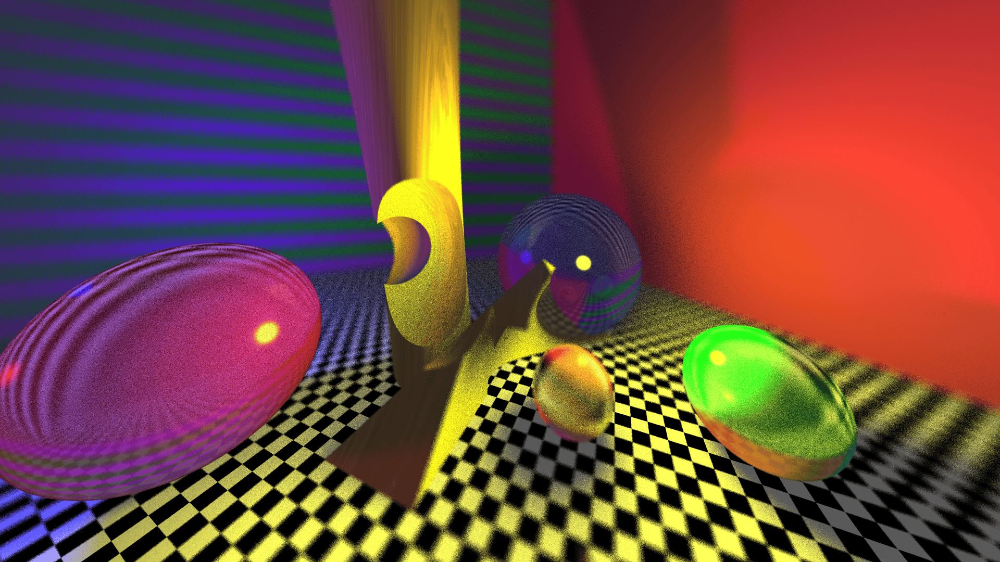

# Ray Tracer - Computação Gráfica (TP2)

Este projeto implementa um Ray Tracer distribuído em C++17, desenvolvido como parte da disciplina de Computação Gráfica. O renderizador suporta diversas primitivas geométricas, materiais diferentes e Geometria Sólida Construtiva (CSG).




## Funcionalidades

### Primitivas Geométricas
*   **Esferas**: Definidas por centro e raio.
*   **Poliedros**: Definidos por um conjunto de planos (interseção de semi-espaços).
*   **Superfícies Quádricas**: Definidas pela equação geral $Ax^2 + By^2 + Cz^2 + Dxy + Exz + Fyz + Gx + Hy + Iz + J = 0$. Permite criar cilindros, cones, elipsoides, paraboloides, etc.

### Geometria Sólida Construtiva (CSG)
Suporte para operações booleanas entre objetos:
*   **União (+)**: Combina dois ou mais objetos.
*   **Diferença (-)**: Subtrai um objeto de outro.
A implementação permite aninhamento recursivo de operações CSG.

### Materiais e Iluminação
*   **Modelo de Phong**: Componentes ambiente, difusa e especular.
*   **Reflexão**: Reflexão recursiva perfeita.
*   **Refração**: Transparência com Índice de Refração (IOR) usando a Lei de Snell.
*   **Pigmentos**:
    *   Sólido (Cor única).
    *   Checker (Padrão de xadrez 3D).
    *   Texmap (Mapeamento de textura planar a partir de arquivos .ppm).

### Distributed Ray Tracing
O renderizador utiliza superamostragem estocástica (Stratified Sampling/Jittering) para produzir efeitos realistas e reduzir serrilhamento (aliasing):
*   **Anti-aliasing**: Suavização de bordas.
*   **Soft Shadows**: Sombras suaves geradas por luzes de área (amostragem aleatória na fonte de luz).
* **Refrações e Reflexões Imperfeitas** A amostragem aleatória também gera reflexões e refrações imperfeitas, mais realistas do que as do raytracing puro.
### Depth of Field (DOF)**: Simulação de profundidade de campo com abertura de lente e distância focal ajustáveis.

## Implementação

O projeto foi desenvolvido em **C++17**. Abaixo estão os principais detalhes técnicos da implementação:

### 1. Algoritmo de Ray Tracing
O núcleo do renderizador utiliza o algoritmo de **Ray Tracing Recursivo**. O processo para cada pixel segue os passos:
1.  **Geração de Raios**: Raios primários são lançados da câmera em direção à cena.
2.  **Interseção**: O raio é testado contra todos os objetos da cena para encontrar a interseção mais próxima.
3.  **Shading (Sombreamento)**:
    *   **Local**: Calcula-se a iluminação direta usando o modelo de Phong (ambiente + difusa + especular), verificando a visibilidade das luzes (sombras).
    *   **Global (Recursivo)**: Se o material for reflexivo ou transparente, novos raios secundários são gerados e o processo se repete até atingir uma profundidade máxima de recursão.

### 2. Distributed Ray Tracing (Amostragem Estocástica)
Para alcançar maior realismo e resolver problemas de aliasing, o sistema implementa amostragem estratificada:
*   Em vez de um único raio pelo centro do pixel, múltiplos raios são lançados (configurável via `SAMPLES`).
*   Cada raio sofre um pequeno deslocamento aleatório (`jitter`) dentro da área do pixel.
*   Isso permite:
    *   **Anti-aliasing**: Suavização de bordas serrilhadas.
    *   **Depth of Field**: Ao variar a origem do raio sobre um disco (abertura da lente) e focar em um plano específico, simula-se o desfoque de objetos fora de foco.

### 3. Geometria Sólida Construtiva (CSG)
A implementação de CSG não se baseia em geometria de malhas, mas sim em intervalos de interseção:
*   Cada raio que atravessa um objeto convexo gera um ou mais intervalos de entrada e saída `[t_in, t_out]`.
*   As operações booleanas manipulam esses intervalos:
    *   **União**: Adiciona intervalos sobrepostos.
    *   **Diferença**: Remove os intervalos do objeto subtraído dos intervalos do objeto original.

### 4. Estruturas de Dados
*   **Vec3**: Classe fundamental para operações vetoriais (soma, subtração, produtos escalar/vetorial, normalização).
*   **Ray**: Representa um raio com origem e direção.
*   **HitInfo**: Armazena informações sobre a interseção de um raio com um objeto (ponto, normal, t).
*   **Light**: Define uma fonte de luz pontual com posição, cor e atenuação.
*   **Pigment**: Define a cor ou textura de um objeto (Solid, Checker, Texmap).
*   **Finish**: Define as propriedades de reflexão e refração de um material (Phong, reflexão, transmissão, IOR).
*   **Object**: Estrutura genérica que representa qualquer objeto na cena (Esfera, Poliedro, Quádrica, CSG).
*   **Plane**: Representa um plano infinito, usado para definir as faces de poliedros.
*   **Scene**: Armazena a lista de objetos, luzes, pigmentos, acabamentos e configurações da câmera.

## Compilação

O projeto pode ser compilado com `make`, gerando um executável `a.out`.

```bash
make
```

Para limpar os arquivos objeto e o executável:

```bash
make clean
```

Para executar os arquivos de testes, de entrada:

```bash
make tests
```

Estes testes são realizados em alta resolução, então demoram alguns minutos para concluírem.

## Uso

A execução padrão requer um arquivo de cena de entrada e o nome do arquivo de saída. Parâmetros adicionais podem ser passados via linha de comando.

```bash
./a.out <input_scene.in> <output_image.ppm> [width] [height] [aperture] [focus_dist]
```

*   `input_scene.in`: Arquivo de descrição da cena.
*   `output_image.ppm`: Arquivo de imagem gerado (formato PPM).
*   `width` (opcional): Largura da imagem (padrão: 800).
*   `height` (opcional): Altura da imagem (padrão: 600).
*   `aperture` (opcional): Tamanho da abertura da lente para DOF (0.0 = pinhole/sem DOF).
*   `focus_dist` (opcional): Distância do plano de foco, para quando a abertura da lente é maior que zero.

### Exemplo

Isso carrega a cena em `tests/meuteste.in` e a renderiza em uma imagem `results/meuteste.ppm` de resulução `800` x `600`, com abertura da lente de `0.5` e distância focal de `10.0` unidades:

```bash
./a.out tests/meuteste.in results/meuteste.ppm 800 600 0.5 10.0
```


## Formato de Cena (.in)

O arquivo de cena deve seguir estritamente a ordem de definição abaixo:

### 1) Descrição de Câmera
A descrição da câmera ocupa as 4 primeiras linhas do arquivo:
1.  **Posição do olho**: 3 coordenadas (x, y, z).
2.  **LookAt**: 3 coordenadas do ponto para onde a câmera olha.
3.  **Up Vector**: 3 coordenadas do vetor que define a orientação "para cima" da câmera.
4.  **Fovy**: Abertura vertical da câmera em graus (campo de visão).

### 2) Descrição de Luzes
Após a câmera, define-se as luzes:
1.  Um número inteiro indicando a **quantidade de luzes**.
2.  Para cada luz (uma por linha):
    *   3 coordenadas da posição (x, y, z).
    *   3 componentes de cor RGB (0.0 a 1.0).
    *   3 coeficientes de atenuação: constante, linear e quadrático.
    *   *Nota*: A primeira luz é considerada luz ambiente.

### 3) Descrição de Pigmentos
Após as luzes, define-se os pigmentos (materiais de cor/textura):
1.  Um número inteiro indicando a **quantidade de pigmentos**.
2.  Para cada pigmento (uma por linha), inicia-se com o tipo:
    *   **solid**: Seguido de 3 valores RGB.
    *   **checker**: Seguido de 3 valores RGB (cor 1), 3 valores RGB (cor 2) e o tamanho do cubo do padrão.
    *   **texmap**: Seguido do nome do arquivo de textura (.ppm) e 8 valores para mapeamento (dois vetores de 4 elementos para projeção planar).

### 4) Descrição de Acabamentos
Após os pigmentos, define-se os acabamentos (propriedades de superfície):
1.  Um número inteiro indicando a **quantidade de acabamentos**.
2.  Para cada acabamento (uma por linha), 7 valores float:
    *   `ka`: Coeficiente ambiente.
    *   `kd`: Coeficiente difuso.
    *   `ks`: Coeficiente especular.
    *   `alpha`: Expoente de rugosidade (brilho especular).
    *   `kr`: Coeficiente de reflexão.
    *   `kt`: Coeficiente de transmissão (transparência).
    *   `ior`: Índice de refração (n1/n2).

### 5) Descrição de Objetos
Finalmente, define-se os objetos da cena:
1.  Um número inteiro indicando a **quantidade de objetos**.
2.  Para cada objeto, a descrição começa com dois inteiros:
    *   Índice do pigmento.
    *   Índice do acabamento.
3.  Em seguida, o tipo do objeto e seus parâmetros específicos:

    *   **Esfera (`sphere`)**:
        *   Seguido de 4 valores: centro (x, y, z) e raio.
        *   Exemplo: `0 0 sphere 0 0 0 1.0`

    *   **Poliedro (`polyhedron`)**:
        *   Seguido de um inteiro (número de faces).
        *   Para cada face, 4 coeficientes da equação do plano ($Ax + By + Cz + D = 0$).

    *   **Quádrica (`quadric`)**:
        *   Seguido de 10 coeficientes da equação geral da quádrica ($A, B, C, D, E, F, G, H, I, J$).

    *   **CSG (`csg`)**:
        *   Seguido de um inteiro (número de filhos).
        *   Para cada filho:
            *   Uma string de operação: `+` (união) ou `-` (diferença).
            *   A descrição completa do objeto filho (recursivo).
        *   Exemplo de CSG:
            ```plaintext
            0 0 csg 2
            +
            0 0 sphere 0 0 0 1.5
            -
            0 0 sphere 1 0 0 1.2
            ```


## Estrutura do Projeto

*   `src/`: Código fonte (.cpp).
*   `include/`: Cabeçalhos (.h).
*   `tests/`: Arquivos de cena de exemplo (.in).
*   `results/`: Imagens geradas (.ppm).
